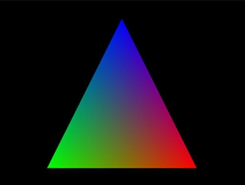
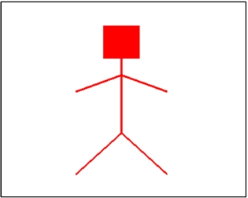
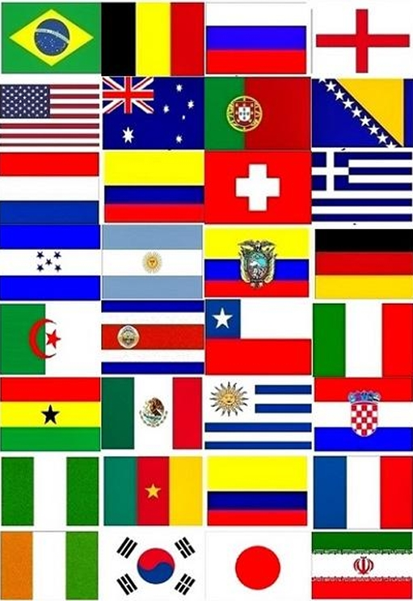

# Atividade (Computação Gráfica [CC0029]) - Introdução ao Open GL

1. Faça programas separados que desenhe os seguintes objetos abaixo: 
    - Documentação do OpenGL (https://www.opengl.org/sdk/docs/man). 

    a) Um triângulo 2D com a seguinte estrutura:

    

    b) Um boneco palito 2D:

    

    c) Uma bandeira de algum país do mundo:

    

## Instalação

Depende do seu sistema operacional. Siga as instruções dadas pela professora: MingW e GLUT no Windows, e G++ com GLU no Linux.
Também recomendo a instalação do CMake para automatizar a build nos seus sistemas.

> Bônus: Se você está usando o VsCode, você pode usar as tasks configuradas no repositório para build e execução.

----

> Os comandos abaixo devem ser executados na pasta raiz da atividade correspondente (onde se encontra `main.cpp`).

----

## Build

### Windows

Execute `build.bat` ou compile com MingW com as flags necessárias. Você também pode usar o script Cmake para compilar o seu projeto no Visual Studio com sua própria _solution_.

### Linux

Execute `build.sh`:
```bash
chmod +x ./build.sh
./build.sh
```
que irá invocar o CMake para gerenciar a build, ou compile com G++ (ou outro compilador de sua escolha) com as flags necessárias.

----

> No VSCode: Abra a paleta de comandos `Ctrl+Shift+P` > `Run Task` > `Build com WSL Bash integrado`

----

## Execução

### Windows

Execute `run.bat` ou execute o programa .exe compilado diretamente.

### Linux

Execute `run.sh`:
```bash
chmod +x ./run.sh
./run.sh
```
ou inicie o executável compilado diretamente.

----

> No VSCode: Abra a paleta de comandos `Ctrl+Shift+P` > `Run Task` > `Run app (WSL)`

----
